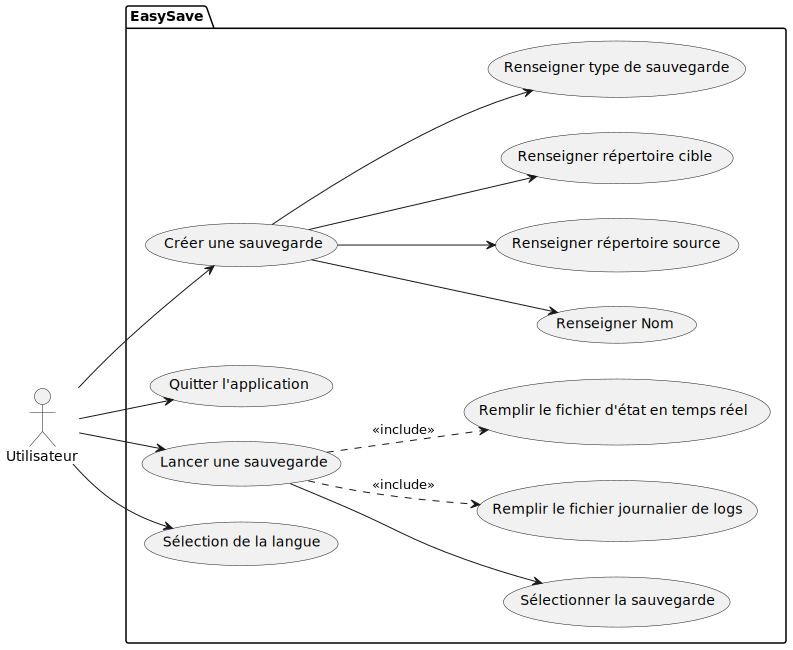
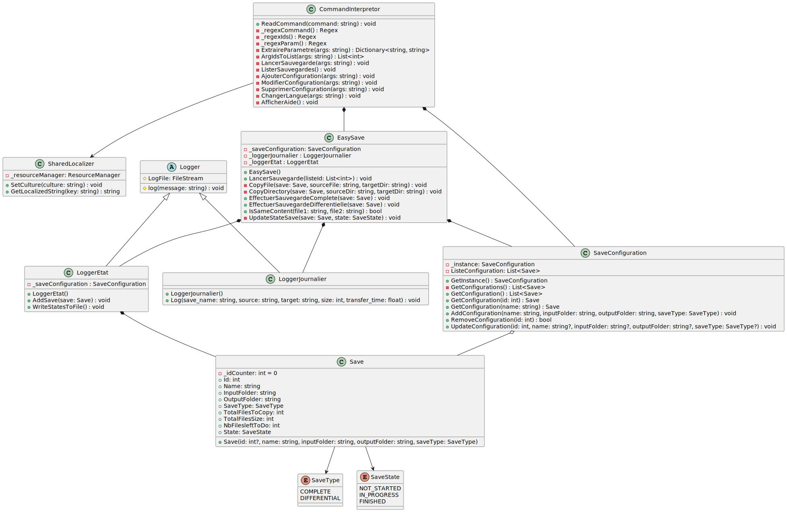
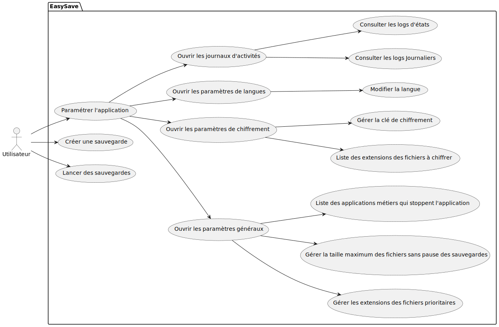
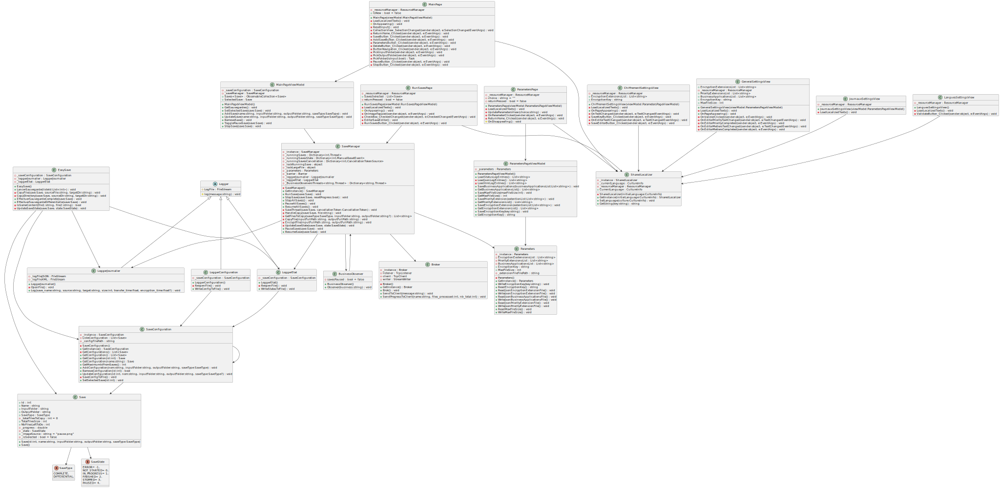

# EasySave
##### Projet bloc Programmation Système - 2024
##### Groupe 4 : CARTERON Pierre - MENANTEAU Melvin - PETIT Victor - VIGNAUD Mathéo

## Présentation du projet
EasySave est un logiciel de sauvegarde de données. Il permet de sauvegarder des fichiers et des dossiers sur un support de stockage externe (disque dur, clé USB, etc.). L'application est capable de réaliser des sauvegardes complètes ou différentielles, de lancer plusieurs travaux de sauvegarde en parallèle, de mettre en pause et de reprendre un travail de sauvegarde, d'arrêter un travail de sauvegarde, de consulter les logs directement depuis l'interface, de définir des fichiers à copier en priorité, de définir des fichiers devant être chiffrés (et pouvoir définir la clé de chiffrement), de copier un seul fichier à la fois si un fichier est trop volumineux pour éviter de saturer la bande passante, de consulter l'état des sauvegardes depuis un poste distant et de mettre en pause la sauvegarde lorsqu'un logiciel métier est détecté. La sauvegarde reprendra automatiquement lorsque le logiciel métier sera fermé.

## Convention de code
Les conventions de code qui seront appliquées à ce projet sont celles recommandées par Microsoft pour le langage C# ([Consultables à cette adresse](https://github.com/dotnet/runtime/blob/main/docs/coding-guidelines/coding-style.md)).

Les points majeurs à retenir sont les suivants :
- Les noms des attributs, méthodes, classes et namespaces doivent être en PascalCase.
- Les noms des attributs privés doivent être en camelCase.
- Les instances de classe privées doivent être préfixées par un underscore.
- Les accolades ouvrantes et fermantes doivent être placées sur une nouvelle ligne.
- Les instructions conditionnelles `if` ne doivent jamais être déclarées sur une seule ligne. Il est possible d'omettre les accolades si tous les blocs d'instruction (`if`, `else`, `else if`) ne contiennent qu'une instruction. Si ce n'est pas le cas, il est nécessaire de placer des accolades pour chaque bloc.
- Le mot clé `this` doit être évité sauf si nécessaire.
- La visibilité des attributs et méthodes doit toujours être déclarée.
- Supprimer tous les espaces inutiles à la fin des lignes.

## Version 1.0

La version 1.0 de EasySave est une application console permettant de créer jusqu'à cinq travaux de sauvegarde, de les lancer (de manière séquentielle), de les modifier et les supprimer. Les travaux de sauvegarde peuvent être de deux types : complète ou différentielle. Il doit également être possible d'utiliser l'application en français ou en anglais. Enfin, l'application doit enregistrer les logs de chaque sauvegarde dans un fichier journalier (contenant donc tous les fichiers copiés durant la journée) et un fichier log contenant l'état de chaque travail de sauvegarde.

### Utilisation du logiciel
**run** (**r**): Permet de lancer un travail de sauvegarde existant. Un id de sauvegarde ou une liste d'id est attendu en paramètre. Si le paramètre all est renseigné, toutes les sauvegardes seront lancées.

- -id : Id des sauvegardes à lancer.

Exemple :
- `run -id "1-3"` : Lance la sauvegarde 1 à 3
- `r -id "1-3"` : Lance la sauvegarde 1 à 3
- `run -id "1;3"` : Lance la sauvegarde 1 et 3
- `run -id "1-3;5;7-9"` : Lance les sauvegardes 1 à 3, 5 et 7 à 9
- `r -all` : Lance toutes les sauvegardes

**list** (**ls**): Permet d'afficher les travaux de sauvegarde configurés ainsi que leur id.

**add**: Permet de créer un travail de sauvegarde. Elle doit contenir les arguments suivants :
- -name / -n  : Nom du travail de sauvegarde
- -inputFolder / -i : Chemin absolue du répèrtoire source du travil de la sauvegarde
- -outputFolder / -o : Chemin absolue du répèrtoire cible du travil de la sauvegarde
- -saveType / -t : Type de travil de la sauvegarde, soit complète (complete) soit différentielle (differential)

**update**: Permet de modifier un travail de sauvegarde existant. L'id du travail à modifier est obligatoire, les autres paramètres sont optionnels selon les champs que l'on souhaite mettre à jour:
- -name / -n  : Nom du travail de sauvegarde
- -inputFolder / -i : Chemin absolue du répèrtoire source du travil de la sauvegarde
- -outputFolder / -o : Chemin absolue du répèrtoire cible du travil de la sauvegarde
- -saveType / -t : Type de travil de la sauvegarde, soit complète (complete) soit différentielle (differential)

**delete**: Permet de supprimer un travail de sauvegarde existant. Un id de sauvegarde ou une liste d'id est attendu en paramètre.

- -id : Id des sauvegardes à lancer.

Exemple :
- `delete -id "1-3"` : Supprime les sauvegarde 1 à 3
- `delete -id "1;3"` : Supprime les sauvegarde 1 et 3
- `delete -id "1-3;5;7-9"` : Supprime les sauvegardes 1 à 3, 5 et 7 à 9

**help** (**h**): Permet d'obtenir la liste des commandes disponibles ainsi qu'une explication sur ces dernières.

**clear** (**cls**): Effacer les lignes précédentes

**exit**: Quitter l'application

Il est possible de rajouter le paramètre "lang" aux commandes afin de changer la langue (actuellement "fr" et "en" sont supportés)

### Cas d'utilisation de EasySave

### Diagramme de classe de EasySave :

## Version 2.0 et 3.0

La version 3.0 (la version 2.0 n'étant qu'un point de contrôle) implémente une interface graphique pour l'application EasySave. Cette interface graphique permet de réaliser les mêmes actions que la version 1.0, mais de manière plus intuitive. Également, de nouvelles fonctionnalités ont été ajoutés :

- Lancer plusieurs travaux de sauvegarde en parallèle
- Mettre en pause et de reprendre un travail de sauvegarde
- Arrêter un travail de sauvegarde
- Consulter les logs directement depuis l'interface
- Définir des fichiers à copier en priorité
- Définir des fichiers devant être chiffrés (et pouvoir définir la clé de chiffrement)
- Si un fichier est trop volumineux, n'en copier qu'un seul à la fois pour éviter de saturer la bande passante
- Consulter l'état des sauvegardes depuis un poste distant
- Lorsqu'un logiciel métier est détecté, mettre en pause la sauvegarde. La sauvegarde reprendra automatiquement lorsque le logiciel métier sera fermé.

### Conception de l'interface graphique
Afin de faire une interface graphique intuitive pour les utilisateurs, nous avons fait en sorte que notre interface soit uniforme quelque soit l'action en cours, que le plus d'informations possible soit lisible directement tout en gardant le plus de légèreté possible et de porter une attention particulière aux couleurs, afin que les boutons d'appel aux actions soit clairement distingués des autres éléments. 
Avant de développer l'interface, nous avons fait un prototype grâce à Figma. Cette maquette est consultable à cette adresse : [Maquette Figma](https://www.figma.com/file/h0wg5Pk5RSOqjisnsjItVY/UI?type=design&node-id=0%3A1&mode=design&t=YucPl4NqAwJ3LCeY-1)

### Cas d'utilisation de EasySave

### Diagramme de classe
