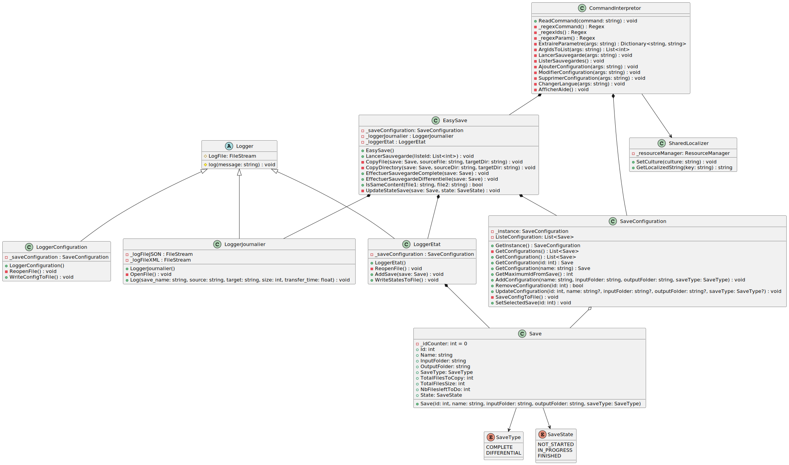

# EasySave
##### Projet bloc Programmation Système - 2024
##### Groupe 4 : CARTERON Pierre - MENANTEAU Melvin - PETIT Victor - VIGNAUD Mathéo

### Cas d'utilisation de EasySave

### Diagramme de classe de EasySave :

### Convention de code
Les conventions de code qui seront appliquées à ce projet sont celles recommandées par Microsoft pour le langage C# ([Consultables à cette adresse](https://github.com/dotnet/runtime/blob/main/docs/coding-guidelines/coding-style.md)).

Les points majeurs à retenir sont les suivants :
- Les noms des attributs, méthodes, classes et namespaces doivent être en PascalCase.
- Les noms des attributs privés doivent être en camelCase.
- Les instances de classe privées doivent être préfixées par un underscore.
- Les accolades ouvrantes et fermantes doivent être placées sur une nouvelle ligne.
- Les instructions conditionnelles `if` ne doivent jamais être déclarées sur une seule ligne. Il est possible d'omettre les accolades si tous les blocs de l'instructions (`if`, `else`, `else if`) ne contiennent qu'une instruction. Si ce n'est pas le cas, il est nécessaire de placer des accolades pour chaque bloc.
- Le mot clé `this` doit être évité sauf si nécessaire.
- La visibilité des attributs et méthodes doit toujours être déclarée.
- Supprimer tous les espaces inutiles à la fin des lignes.
